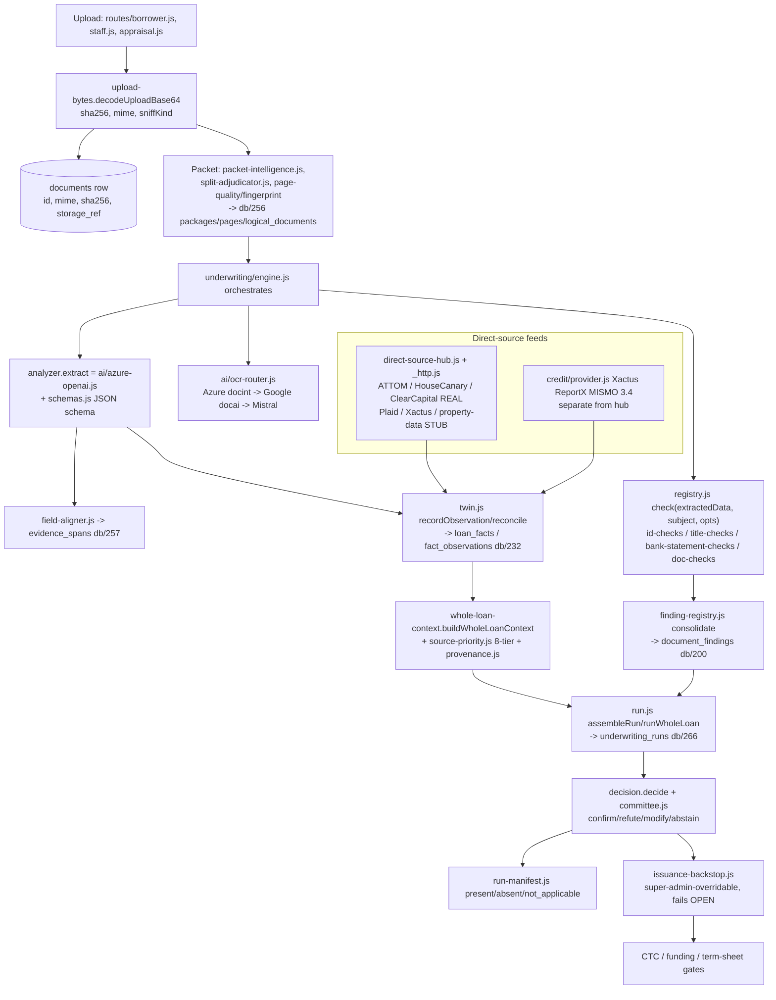
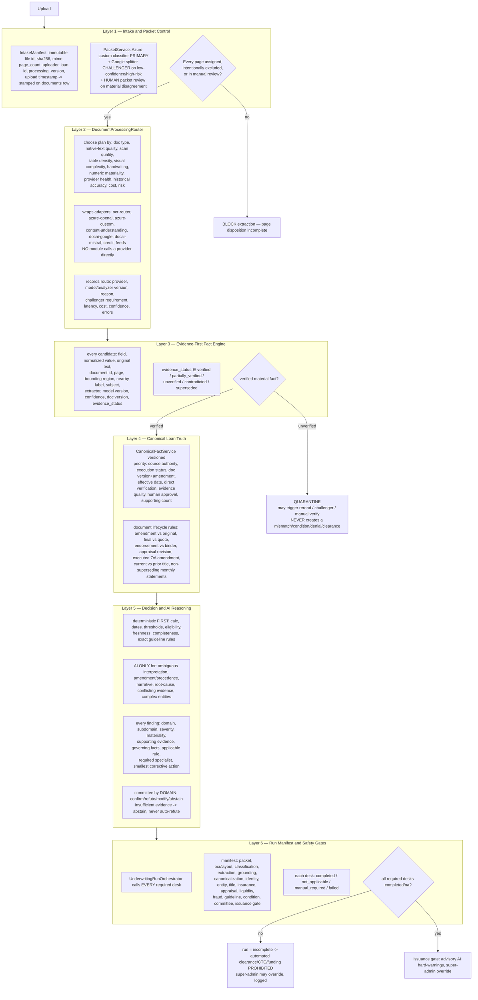

# Underwriting Pipeline v2 — Six-Layer Orchestration Restructure

**Status:** DESIGN DELIVERABLE — for owner review and approval. **No pipeline-v2 code is
written until this is approved** (owner directive, 2026-07-26).

**Governing principle:** This is an *additive, versioned wrapper AROUND* the existing
system. We do **not** delete or rewrite any current underwriting module, database table,
finding, condition, guideline engine, digital twin, learning engine, or UI. Every current
behavior keeps working unchanged while v2 runs in shadow, and we promote one document
family at a time with an immediate rollback to v1.

> **Headline finding from the codebase audit:** five of the six target layers already
> exist as substantial, named, tested modules with backing schema. The restructure is
> mostly an *activation / adapter / formalization* job, not a greenfield rebuild. The
> genuinely-new work is small and specific (listed in §6). This is good news: it means
> lower risk, a shorter path, and that "preserve everything" is the natural default.

---

## 1. Purpose and guardrails

The owner wants every loan to follow **one controlled, evidence-first pipeline** with six
named layers, so that:

- no material **unverified** value can ever enter an underwriting check;
- every page of every upload is explicitly **dispositioned** (assigned, excluded, or sent
  to human review) before any extraction begins;
- every material fact carries **page-level evidence** (which document, which page, where on
  the page);
- every provider call (Azure, Google, Content Understanding, an LLM, a data feed) goes
  through **one centralized adapter** with health/timeout/retry/circuit-breaker and a
  recorded route (provider, model version, reason, latency, cost, confidence);
- every finding has a **formal domain, severity, and materiality** and a qualified reviewer;
- every required **review desk** appears in a per-run **manifest**, and a missing/failed
  desk **blocks automated issuance** (never silently "passes");
- v1 and v2 can run **side by side in shadow**, be compared, and be promoted or rolled
  back one family at a time.

### The one policy tension, and how we resolve it

The owner's Layer 6 says *"missing or failed reviews block issuance / CTC / funding."* The
standing governing rule (owner-directed) is *"the AI never blocks; every gate is a
super-admin-overridable HARD WARNING."* These are **not** in conflict once we separate two
different things:

- **Process-completeness gate (deterministic, may hard-stop AUTOMATED actions).** "Did every
  required desk actually run and return a status?" is a *bookkeeping* question, not an AI
  judgment. If a required desk is missing/failed/manual-required, the run is `incomplete`
  and **automated** clearance / auto-CTC / auto-funding are **prohibited**. This is allowed
  to hard-stop *the automation* because it is not the AI deciding the loan is bad — it is
  the system saying "we are not done checking yet."
- **AI-judgment gate (advisory, never an un-overridable block).** Any conclusion the AI
  reaches about the *merits* (a fatal finding, a guideline conflict) remains a
  super-admin-overridable hard warning that fails **open**.

So: a **human super-admin can always override and proceed** (logged), which satisfies "the
AI never blocks," while the *automation* will not clear a loan whose desks did not all run,
which satisfies "missing ≠ passed." Both invariants hold. This reconciliation is a first-
class requirement of the design, not an afterthought.

---

## 2. Current-state architecture (as-built, verified)

Today the flow is real and works, but the stages are **implicit** — they are wired through
`engine.js` and the routes rather than sequenced by one orchestrator, and the "is this
value verified?" gate lives in several places rather than one.



**What already exists and is tested (verified in the audit):**

- **Intake/packet:** `upload-bytes.js` (single decode chokepoint, sha256, mime sniff);
  `db/256` packet lifecycle (`document_packages`, `document_pages`, `logical_documents`
  with `version_status`, `document_relationships`, `document_lifecycle_events`);
  `page-fingerprint.js`, `page-quality.js`, `page-range-enforcer.js`,
  `continuation-group.js`, `split-adjudicator.js` (primary/challenger), `packet-intelligence.js`.
- **Provider plane (already centralized under `src/lib/ai/`):** `ocr-router.js` (live OCR
  router: Azure → Google → Mistral + weak-page reread), `routing-matrix.js` (document-aware
  plan, advisory), `docint.js`, `docai-google.js`, `docai-mistral.js`, `azure-custom.js`,
  `azure-openai.js`, `anthropic.js`, `committee.js`; **`resilience.js` = shared
  retry + backoff + per-endpoint circuit breaker** used by all of them; `cost-meter.js`,
  `langfuse.js`, `stack-health.js`.
- **Data feeds:** `direct-source-hub.js` + `_http.js` (one guarded HTTP door) with real
  ATTOM / HouseCanary / Clear Capital connectors; `credit/provider.js` is a **real Xactus
  Credit ReportX (MISMO 3.4)** client that currently sits *outside* the hub.
- **Evidence ledger (`db/257`):** `evidence_spans` (polygon, quote, engine+version,
  `status` active/superseded/invalid), `fact_evidence_links` (support_type incl.
  `contradicting`), `finding_evidence_links`, `condition_requirement_evidence`;
  `evidence-ledger.js` with a hallucinated-citation guard.
- **Facts / twin (`db/232`):** `loan_facts` (7-state status incl. `verified`, temporal
  `effective_from/to`), `fact_observations` (append-only per source), `fact_events`;
  `twin.js`.
- **Canonical truth:** `whole-loan-context.js`, `source-priority.js` (8-tier authority
  order), `provenance.js`, **`document-version-resolver.js`** (family + current/superseded/
  draft/amendment/duplicate).
- **Decision/committee:** `run.js`, `decision.js`, `finding-registry.js`, `committee.js`
  + domain-based `committee-routing.js` (verdicts already **confirm/refute/modify/abstain**,
  abstain-on-uncertainty held for a human).
- **Run manifest & gates (`db/266`):** `underwriting_runs` (+ snapshots/calcs/findings/
  decisions, one-current-run index, reproducible `source_hash`), `run-manifest.js`,
  `issuance-backstop.js` (fails open, super-admin override), `run-trigger.js` (debounce).
- **Shadow/canary harness (`db/262`):** `shadow_decisions`, `release_decisions`,
  `artifact_versions`, `evaluation_*`; `shadow-decision.js`, `shadow-capture.js`,
  `canary-controller.js`, `release-gate.js`, `replay-runner.js`, `reliability.js`.

**The real gaps (what makes today "implicit" instead of "controlled"):**

1. No single **`DocumentProcessingRouter`** that selects the *whole plan* per document
   (OCR + extractor + challenger requirement) and records provider/model-version/reason/
   latency/cost/confidence as one route record. `ocr-router` does OCR fallback; the *plan
   selection with a recorded route* is not unified.
2. The **`check(extractedData, subject, opts)`** signature lets *any* extracted value reach
   a check. There is a grounding "quarantine" in `issuance-policy.js`/`grounding.js`, but it
   is not a hard, universal "only verified facts enter checks" contract at the check
   boundary.
3. **Three separate status vocabularies** (span active/superseded/invalid; fact 7-state;
   grounding verified/unverified) instead of **one** evidence-status enum
   (verified / partially_verified / unverified / contradicted / superseded).
4. Findings carry severity but **no formal `materiality`** dimension and **no persisted
   `domain`** (domain is derived at routing time).
5. The run manifest enumerates **5 orchestration components**, not the owner's **full
   ~18-desk list** with per-desk `completed / not_applicable / manual_required / failed`.
6. `card-ocr.js` (OCR.space) bypasses `ocr-router`; `credit/provider.js` bypasses the hub;
   there is **no Secretary-of-State / business-registry adapter** at all.
7. No **`UNDERWRITING_PIPELINE_VERSION=v1|v2`** flag or `pipeline` artifact type to drive a
   monolithic v1/v2 shadow comparison (the shadow/canary machinery exists, but is keyed on
   per-artifact versions today).

---

## 3. Target six-layer architecture



Each layer, precisely:

- **Layer 1 — Intake & Packet Control.** On upload, stamp an **immutable intake manifest**:
  file id, SHA-256, original filename, MIME, **page count**, upload timestamp, loan id,
  uploader, **processing version**. Then run **packet analysis before extraction**: identify
  each logical document, multiples of the same type, continuation pages, blank pages,
  duplicates, rotated/unreadable pages, page ranges, classification confidence, disputed
  boundaries. **Azure custom classifier is primary; Google splitter is the challenger** for
  packets / low-confidence boundaries / high-risk files; **human packet review** when they
  materially disagree. **No extraction starts until every page is assigned, intentionally
  excluded, or placed in manual review.**
- **Layer 2 — DocumentProcessingRouter.** One router. **No module may call Azure, Google,
  Content Understanding, or an LLM directly.** It picks the plan from doc type, native-text
  quality, scan quality, table density, visual complexity, handwriting, numeric materiality,
  provider health, historical accuracy, cost, and risk — and **records the route** (provider,
  model/analyzer version, reason, challenger requirement, latency, cost, confidence, errors).
  Routing examples are exactly the owner's list (clean native → native + Azure Layout;
  scanned → Azure DocInt; bank statement → Azure + numeric challenger; complex OA/contract →
  Azure Layout + Content Understanding; weak pages → rerender+reread only those; boundary
  uncertainty → Google splitter challenger; appraisal → MISMO XML first).
- **Layer 3 — Evidence-First Fact Engine.** AI output is **never automatically a loan fact.**
  Every candidate carries the full evidence envelope and one **evidence_status** of
  `verified / partially_verified / unverified / contradicted / superseded`. **Only verified
  material facts enter deterministic checks.** Unverified values are **quarantined** (may
  trigger targeted reread / challenger / manual verification) and **can never create a
  mismatch, condition, denial, or clearance.** Check signature moves from
  `check(extractedData, loan)` to **`check(verifiedFactSet, evidenceContext, loanContext)`.**
- **Layer 4 — Canonical Loan Truth.** One versioned **CanonicalFactService** picks the
  governing fact by the owner's priority order (source authority → execution status →
  document version/amendment → effective date → direct independent verification → evidence
  quality → human approval → supporting-source count). Repeated information is **not**
  automatically true. It understands lifecycle rules (amendment vs original, final binder vs
  quote, endorsement vs binder, appraisal revision, executed OA amendment, current vs prior
  title, separate monthly statements that don't supersede each other). **All downstream
  modules read facts from this service** rather than re-interpreting documents.
- **Layer 5 — Decision & AI Reasoning.** **Deterministic code first** for calculations,
  dates, thresholds, eligibility, freshness, completeness, exact guideline rules. **AI only**
  for ambiguity, amendment/precedence reasoning, narrative, root-cause, conflicting evidence,
  complex entity/transaction relationships. Every finding carries formal **domain, subdomain,
  severity, materiality**, supporting evidence, governing facts, applicable rule, required
  specialist, and the **smallest corrective action**. Committee is routed **by domain**;
  outcomes are **confirm / refute / modify / abstain**; **insufficient evidence → abstain,
  never auto-refute**. No AI conclusion overrides a deterministic fact or clears a condition
  without evidence.
- **Layer 6 — Run Manifest & Safety Gates.** One **UnderwritingRunOrchestrator** calls every
  required service; controllers/routes/UI never call a desk directly. Every run produces a
  **manifest** of the ~18 desks, each `completed / not_applicable / manual_required / failed`.
  **Missing output cannot mean "passed."** If any required desk is missing/failed/manual-
  required: run status = `incomplete`; automated clearance, CTC, and funding authorization
  are **prohibited** (super-admin may override, logged — see §1 reconciliation).

---

## 4. Existing modules that are PRESERVED (kept as-is)

Nothing here is deleted or rewritten. These keep running unchanged; v2 wraps or reads them.

| Area | Preserved module(s) / schema |
|---|---|
| Upload decode | `src/lib/upload-bytes.js` (`decodeUploadBase64`, sha256, sniff) |
| Packet lifecycle | `db/256`; `packet-intelligence.js`, `split-adjudicator.js`, `page-fingerprint.js`, `page-quality.js`, `page-range-enforcer.js`, `continuation-group.js` |
| OCR engines | `ai/docint.js`, `ai/docai-google.js`, `ai/docai-mistral.js`, `ai/azure-custom.js`, `ai/layout-capture.js` |
| Reasoning engines | `ai/azure-openai.js`, `ai/anthropic.js`, `ai/committee.js`, `ai/committee-routing.js` |
| Provider resilience | `ai/resilience.js` (circuit breaker), `ai/cost-meter.js`, `ai/langfuse.js`, `ai/stack-health.js` |
| Extraction | `underwriting/engine.js`, `schemas.js`, `registry.js`, `field-aligner.js`, `facts.js`, `tieout.js` |
| Evidence ledger | `db/257`; `evidence-ledger.js`, `evidence-coverage.js`, `evidence-invalidation.js`, `evidence-set-builder.js` |
| Digital twin / facts | `db/232`; `twin.js` |
| Canonical truth | `whole-loan-context.js`, `source-priority.js`, `provenance.js`, `document-version-resolver.js` |
| Decision | `run.js`, `decision.js`, `finding-registry.js`, `uw-status.js`, `verdict.js` |
| Run + gates | `db/266`; `run-manifest.js`, `issuance-backstop.js`, `run-trigger.js`, `run-cockpit.js`, `run-diff.js` |
| Shadow/canary | `db/262`; `shadow-decision.js`, `shadow-capture.js`, `canary-controller.js`, `release-gate.js`, `replay-runner.js`, `reliability.js` |
| Data feeds | `direct-source-hub.js`, `_http.js`, `attom.js`, `housecanary.js`, `clearcapital.js` |
| Frozen (untouched) | all pricing/guideline engines (`standard-program.js`, `gold-standard.js`, `pricing.js`, `termsheet.js`, `title-cost.js`), Encompass read-only client |

## 5. Modules that BECOME ADAPTERS (wrapped behind Layer 2 / Layer 4)

They keep their code; the change is that **callers stop calling them directly and go through
the router/service instead**, and each call gets a recorded route.

| Adapter (Layer 2, unless noted) | Today | Change |
|---|---|---|
| `ai/azure-openai.js` | called directly by ~7 modules | callers route through `DocumentProcessingRouter.reason()` |
| `ai/docint.js`, `docai-google.js`, `docai-mistral.js` | behind `ocr-router.js` already | `ocr-router` becomes the OCR arm of the router; route recorded |
| `ai/azure-custom.js` | called directly by 5 modules | route through the router's classify/extract arm |
| **Azure Content Understanding** | **not present yet** | new adapter `ai/content-understanding.js` behind the router |
| `credit/provider.js` (Xactus) | bypasses the hub | fold under `direct-source-hub` as the credit arm |
| `integrations/card-ocr.js` (OCR.space) | bypasses `ocr-router` | fold into the OCR router |
| `direct-source-connectors/{attom,housecanary,clearcapital}.js` | behind the hub already | unchanged; hub is the Layer-2 arm for property data |
| **Secretary-of-State / business registry** | **no connector** | new adapter (owner-gated on a vendor account) |
| `twin.js` + `source-priority.js` + `document-version-resolver.js` | separate helpers | composed behind the **Layer-4 `CanonicalFactService`** facade |

## 6. New orchestrator components to build (the genuinely-new work)

Small and specific. Everything else is activation/wiring.

1. **`src/lib/pipeline/intake-manifest.js`** + migration to stamp `page_count` and
   `processing_version` onto the `documents` row (today only in sidecar tables) — Layer 1.
2. **`src/lib/pipeline/packet-control.js`** — the "no extraction until every page is
   dispositioned" gate + disputed-boundary human-review queue (wraps existing packet
   modules; adds Azure-classifier-primary / Google-splitter-challenger orchestration record).
3. **`src/lib/pipeline/document-processing-router.js`** — Layer 2 router that selects the
   whole plan and writes a **`processing_routes`** record (new table) per document.
4. **`ai/content-understanding.js`** — new Azure Content Understanding adapter.
5. **Unified evidence-status enum** — a single `evidence_status`
   (verified/partially_verified/unverified/contradicted/superseded) surfaced across span +
   fact + finding, plus the **`check(verifiedFactSet, evidenceContext, loanContext)`**
   signature (a compatibility shim keeps old checks working during migration).
6. **`src/lib/pipeline/canonical-fact-service.js`** — Layer-4 versioned facade over twin +
   source-priority + version-resolver + explicit lifecycle rules.
7. **Formal `materiality` (and persisted `domain`) on findings** — new columns +
   population in `finding-registry.js`.
8. **Extend `run-manifest.js`** to the full ~18-desk list with
   `completed / not_applicable / manual_required / failed`, and wire the
   **process-completeness gate** (§1) into the issuance path.
9. **`UnderwritingRunOrchestrator`** — the single entry that calls every desk (thin wrapper
   composing existing desks; controllers/routes call only this).
10. **`UNDERWRITING_PIPELINE_VERSION=v1|v2` flag + `pipeline` artifact type** — drives
    v1/v2 shadow comparison on the existing `shadow_decisions` / `release_decisions` /
    `canary-controller` machinery.
11. **Provider health checks / SoS adapter gaps** — add health probes for any adapter that
    lacks one; fold `card-ocr` + `credit/provider` under the router/hub.

## 7. Database migrations required (new numbered idempotent files)

All additive, `IF NOT EXISTS`, with backfills for existing files where needed. Numbers are
placeholders (next free at build time).

| # | File | Adds |
|---|---|---|
| M1 | `db/3NN_intake_manifest.sql` | `documents.page_count`, `documents.processing_version`, `documents.intake_manifest_at`; backfill page_count from `document_packages` |
| M2 | `db/3NN_processing_routes.sql` | `processing_routes` (per-document plan record: provider, model/analyzer version, reason, challenger_required, latency_ms, cost_cents, confidence, errors) |
| M3 | `db/3NN_evidence_status.sql` | unified `evidence_status` column/enum on the candidate/fact path; view mapping existing span/fact statuses into it |
| M4 | `db/3NN_finding_materiality.sql` | `document_findings.materiality`, `document_findings.domain`, `document_findings.subdomain` (+ same on `underwriting_run_findings`); backfill from severity/category |
| M5 | `db/3NN_run_manifest_desks.sql` | `underwriting_run_desks` (per-run, per-desk status completed/not_applicable/manual_required/failed) |
| M6 | `db/3NN_pipeline_version.sql` | `pipeline` artifact type rows in `artifact_versions`; per-file `pipeline_version` shadow assignment |
| M7 | `db/3NN_packet_disposition.sql` | page-disposition state + `disputed_boundaries` review queue (extends `db/256`) |

No existing migration is edited; no table is dropped.

## 8. Vendors, resources, model IDs, and secrets required

**One vendor at a time.** Each row says who provides it, what to create, and which secrets it
needs. "Have" = already wired in `src/config.js`; "New" = you must create/enter it.

| Vendor / resource | What to create | Secrets (Render env) | Status |
|---|---|---|---|
| **Azure Document Intelligence** (existing resource) | custom **packet classifier**; custom **extractors** for bank statement, insurance, contract, operating agreement, title, appraisal, settlement, IDs; composed-model routing; `splitMode=auto`; GA API `2024-11-30` | `AZURE_DOCINT_ENDPOINT`, `AZURE_DOCINT_KEY`, `AZURE_DOCINT_API_VERSION`, `AZURE_DOCINT_LAYOUT_MODEL=prebuilt-layout`, `AZURE_DOCINT_CLASSIFIER_ID`, `AZURE_DOCINT_CLASSIFIER_VERSION`, `AZURE_DOCINT_EXTRACTOR_{BANK_STATEMENT,INSURANCE,CONTRACT,OPERATING_AGREEMENT,TITLE,APPRAISAL,SETTLEMENT}` | endpoint/key HAVE; classifier + extractor IDs NEW (must train + paste IDs) |
| **Azure Content Understanding** | one production resource; analyzers for complex contracts/amendments, operating agreements/authority, title/vesting, insurance coverage, general-complex | `AZURE_CONTENT_UNDERSTANDING_ENDPOINT`, `AZURE_CONTENT_UNDERSTANDING_KEY`, `AZURE_CONTENT_UNDERSTANDING_API_VERSION=2025-11-01`, `AZURE_CU_ANALYZER_{CONTRACT,ENTITY,TITLE,INSURANCE,GENERAL_COMPLEX}` | ALL NEW (resource + analyzers + keys) |
| **Google Document AI** | one Enterprise Document OCR processor; one Custom Splitter processor; (later) selected custom extractors | `GOOGLE_DOCAI_PROJECT_ID`, `GOOGLE_DOCAI_LOCATION=us`, `GOOGLE_DOCAI_OCR_PROCESSOR_ID`, `GOOGLE_DOCAI_SPLITTER_PROCESSOR_ID`, `GOOGLE_DOCAI_SPLITTER_PROCESSOR_VERSION`, `GOOGLE_DOCAI_KEY_JSON` (whole service-account JSON as ONE protected secret) | key/project partially wired; **splitter processor NEW**; service-account JSON NEW |
| **Azure OpenAI** (existing) | keep; place all calls behind the router; separate deployments for extraction / reasoning / vision | `AZURE_OPENAI_ENDPOINT`, `AZURE_OPENAI_KEY`, `AZURE_OPENAI_API_VERSION`, `AZURE_OPENAI_EXTRACTION_DEPLOYMENT`, `AZURE_OPENAI_REASONING_DEPLOYMENT`, `AZURE_OPENAI_VISION_DEPLOYMENT` | endpoint/key/one-deployment HAVE; **3 named deployments NEW** |
| **Xactus** (credit/fraud) | already live (`credit/provider.js`); needs a sample response XML to finish the parser; keep behind the hub | `XACTUS_*` (already in config) | live client HAVE; sample XML NEEDED to finish |
| **Plaid** | **skipped** by owner directive | — | SKIP |
| **Secretary-of-State / business registry** | owner-gated: needs a vendor account before a live adapter | (TBD once vendor chosen) | GATED on vendor account |

**Never commit any of these.** A secret pasted into chat is considered compromised and must
be rotated; all values are entered by the owner in the Render dashboard.

## 9. Exact Render environment-variable checklist

Grouped for the dashboard. **Bold = you must add/enter it. Plain = already set.**

```
# --- Azure Document Intelligence ---
AZURE_DOCINT_ENDPOINT                         (have)
AZURE_DOCINT_KEY                              (have)
AZURE_DOCINT_API_VERSION=2024-11-30           (set/confirm)
AZURE_DOCINT_LAYOUT_MODEL=prebuilt-layout     (set/confirm)
**AZURE_DOCINT_CLASSIFIER_ID**                (after training the packet classifier)
**AZURE_DOCINT_CLASSIFIER_VERSION**
**AZURE_DOCINT_EXTRACTOR_BANK_STATEMENT**
**AZURE_DOCINT_EXTRACTOR_INSURANCE**
**AZURE_DOCINT_EXTRACTOR_CONTRACT**
**AZURE_DOCINT_EXTRACTOR_OPERATING_AGREEMENT**
**AZURE_DOCINT_EXTRACTOR_TITLE**
**AZURE_DOCINT_EXTRACTOR_APPRAISAL**
**AZURE_DOCINT_EXTRACTOR_SETTLEMENT**

# --- Azure Content Understanding (all new) ---
**AZURE_CONTENT_UNDERSTANDING_ENDPOINT**
**AZURE_CONTENT_UNDERSTANDING_KEY**
**AZURE_CONTENT_UNDERSTANDING_API_VERSION=2025-11-01**
**AZURE_CU_ANALYZER_CONTRACT**
**AZURE_CU_ANALYZER_ENTITY**
**AZURE_CU_ANALYZER_TITLE**
**AZURE_CU_ANALYZER_INSURANCE**
**AZURE_CU_ANALYZER_GENERAL_COMPLEX**

# --- Google Document AI ---
**GOOGLE_DOCAI_PROJECT_ID**
GOOGLE_DOCAI_LOCATION=us
**GOOGLE_DOCAI_OCR_PROCESSOR_ID**
**GOOGLE_DOCAI_SPLITTER_PROCESSOR_ID**
**GOOGLE_DOCAI_SPLITTER_PROCESSOR_VERSION**
**GOOGLE_DOCAI_KEY_JSON**   (paste the FULL service-account JSON as one secret)

# --- Azure OpenAI ---
AZURE_OPENAI_ENDPOINT                         (have)
AZURE_OPENAI_KEY                              (have)
AZURE_OPENAI_API_VERSION                      (have)
**AZURE_OPENAI_EXTRACTION_DEPLOYMENT**        (name of the extraction deployment)
**AZURE_OPENAI_REASONING_DEPLOYMENT**         (name of the reasoning deployment)
**AZURE_OPENAI_VISION_DEPLOYMENT**            (name of the vision deployment)

# --- Pipeline control (new, safe defaults) ---
UNDERWRITING_PIPELINE_VERSION=v1              (v1 until v2 is promoted; v2 shadow runs regardless)

# --- Xactus (credit) --- already present; no change; Plaid intentionally skipped
```

## 10. Phased migration plan

1. **Scaffold in shadow (no user impact).** Build the Layer 1–6 wrapper + adapters behind
   `UNDERWRITING_PIPELINE_VERSION`. v1 stays the only thing users see. v2 runs on the **same
   files** and stores its results next to v1's; **v2 decisions are never shown**.
2. **Compare.** For every shadowed file, diff v1 vs v2 on: packet boundaries, document
   classifications, extracted material facts, evidence grounding, findings, conditions,
   clearances, final recommendation (this is exactly what `shadow_decisions` records).
3. **Promote one document family at a time.** Start with the highest-volume, lowest-risk
   family (e.g. bank statements), prove acceptance metrics on it, then flip that family to
   v2 while everything else stays v1. Repeat family by family.
4. **Retire old paths only after v2 passes acceptance** for a family — never before.
5. Throughout, **v1 remains intact and one env flip away.**

## 11. Rollback plan

- **Instant, no deploy:** `UNDERWRITING_PIPELINE_VERSION=v1` (and/or `WHOLE_LOAN_RUN_DISABLED`
  kill switch) returns every file to v1 immediately.
- **Per-family rollback:** the `canary_scope` / per-family promotion flag reverts a single
  family to v1 without touching the others (reuses `canary-controller.js` + `release_decisions.rollback_version`).
- **Because v2 is additive:** no v1 table or module is changed, so rollback is a flag flip,
  not a code revert. Existing files are unaffected.
- **Auto-rollback:** the existing `release-gate.js` / `canary-controller.js` trip a family
  back to v1 if a hard metric (false clears, fatal-recall) regresses.

## 12. Test plan and acceptance metrics

Acceptance criteria (owner's list) → how we test each:

| Acceptance criterion | Test |
|---|---|
| No material unverified value enters checks | unit: check boundary rejects any candidate whose `evidence_status !== verified`; property test over the fact set |
| Every page gets a packet disposition | integration: a file cannot begin extraction until every `document_pages` row is assigned/excluded/manual |
| Every material fact has page-level evidence | evidence-coverage test: each material fact resolves to ≥1 `evidence_spans` with a polygon |
| Every finding has a formal domain + reviewer | unit: `finding-registry` populates domain+materiality; committee routes every finding to a domain or holds for human |
| Every required desk in the manifest | integration: run produces `underwriting_run_desks` covering the full ~18-desk list |
| Missing/failed reviews block issuance | integration: an `incomplete` run prohibits automated CTC/funding; super-admin override is logged |
| Provider calls centralized through adapters | static test: grep proves no module calls a provider outside the router/hub |
| Every provider has health/timeout/retry/breaker | unit: each adapter exposes `probe()` + goes through `resilience.js` |
| Every model/analyzer version recorded | integration: every `processing_routes` row has provider + model/analyzer version |
| v1 and v2 run in parallel | integration: shadow run writes both decisions + a `difference_category` |
| Golden-file tests cover DSCR and RTL | reuse `golden-*` + `replay-runner.js`; add DSCR + RTL golden files |
| Senior-underwriter-approved expected results | the golden production dataset (already built) is the sign-off gate |
| Dashboards show the headline numbers | reuse the strict production-metrics dashboard (false clears, missed material issues, false conditions, provider accuracy, latency, cost) |

Plus: `node --check` on every changed file, eslint `no-undef` on changed JSX, the full
`npm test` suite (incl. the real-Postgres `*-db.js` suites) green in CI, and the mandatory
two-audit gate on every merge.

## 13. Owner actions required — plain language, one vendor at a time

See the companion owner summary. In short, in this order: (1) Azure Document Intelligence —
train the classifier + extractors and paste their IDs; (2) Azure Content Understanding —
create the resource + analyzers and paste the keys/IDs; (3) Google Document AI — create the
OCR + splitter processors and paste the service-account JSON; (4) Azure OpenAI — create the
three named deployments; (5) Xactus — hand over one sample response file so the parser can be
finished. Plaid is skipped. Secretary-of-State stays parked until a vendor account exists.
