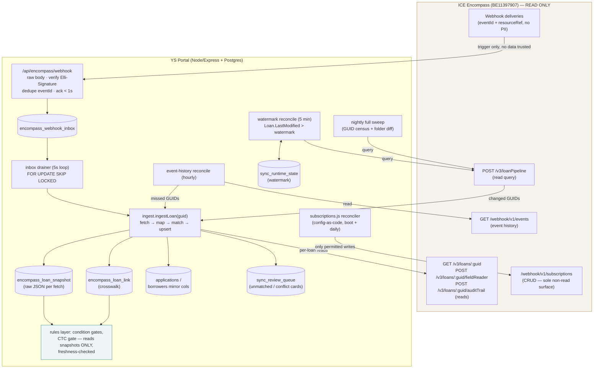

# F2 — Encompass Pull-Sync Architecture Proposal (design only)

Research agent F2. Design for the Phase-1 **strictly one-directional** Encompass → portal sync for YS Capital (instance BE11397907), reusing the proven ClickUp sync patterns in `/home/user/yscap/yscap-repo-root_8`. Inputs: A2 (ClickUp sync architecture), C3 (pipeline queries/discovery/rate limits), C4 (webhooks/event history). All repo paths below are relative to `/home/user/yscap/yscap-repo-root_8` unless absolute.

**Design invariant:** Encompass data flows INTO the portal only. No portal state ever flows to Encompass. The only permitted non-read Encompass calls are webhook-subscription CRUD under `/webhook/v1/subscriptions` (platform plumbing, not loan data — C4 §10), enforced by a deny-by-default method+path allowlist in a single HTTP client chokepoint (the pattern of `src/clickup/client.js:15-99`, inverted).

---

## 1. Component map and module layout

Mirror the ClickUp module names 1:1 so every proven pattern transfers (per A2 §11):

```
src/encompass/
  client.js        — read-only HTTP client: OAuth2 token cache, method+path allowlist,
                     concurrency gate, tagged errors, X-Concurrency header adaptation
  fields.js        — canonical-field registry (Loan.* canonicals, Fields.NNNN, CX.* ids)
  crosswalk.js     — milestone/status/folder label maps → portal values
  status.js        — Encompass milestone/status → portal `applications.status` derivation
  ingest.js        — encompassLoan → portal upsert: match, COALESCE fill-only enrich,
                     snapshot write, review-card producers
  subscriptions.js — config-as-code webhook subscription reconciler (sole write surface)
src/routes/encompass-webhook.js — raw-body receiver (mounted before express.json())
src/sync/encompass-sync.js      — loops: inbox drain, watermark reconcile, event-history
                                  reconcile, nightly sweep, backfill one-shot, audits
db/1NN_encompass_sync_core.sql  — encompass_loan_link, encompass_loan_snapshot,
                                  encompass_webhook_inbox, applications.encompass_* columns
```

Loops run inside the single Express process behind `RUN_SYNC=1`, exactly like `src/server.js:404` starts the ClickUp loops (A2 §1). All loops gated by a new master switch `ENCOMPASS_SYNC_ENABLED`, with the staged sub-switches described in §10.

### Why loop-driven, not `sync_queue`-driven

`sync_queue` (`db/schema.sql:302-317`) already reserves `target='encompass'` (`db/schema.sql:306`), but it is an **outbox** shape (`entity_type`/`entity_id`/`op` pointing at portal entities to push outward). Phase 1 has zero pushes. Recommendation (matching A2's): **the pull path stays loop-driven** like ClickUp's inbound side — durable state lives in the webhook inbox table, the watermark row, and per-loan `fetch_pending` flags, not in `sync_queue` rows. Two `sync_queue` provisions anyway:

1. **Defensive scoping** — any future worker must claim only ops it handles. The legacy worker's claim query hard-filters `op='create'` for exactly this reason (`src/sync/queue.js:44-57`, 2026-07-12 audit note: an unscoped claim silently marked other workers' jobs `done` without pushing). A CHECK or code-level assertion should refuse `INSERT INTO sync_queue ... target='encompass'` during Phase 1 (see §9 guard G6) so nothing can quietly stage an Encompass write.
2. The **structural retry contract** of `queue.js:65-72` (attempts+1, `2^attempts` capped 3600s, `run_after`) is reused verbatim as the retry math for the inbox drainer and per-loan fetch flags (§8).

---

## 2. Data-flow diagram (one-directional)



Every arrow into ICE except `SUBREC → SUB` is a read. There is no arrow carrying portal data to Encompass anywhere in the system.

The convergence property is copied from ClickUp (A2 §2): webhook, watermark poll, nightly sweep, event-history reconcile, and backfill **all funnel into one idempotent `ingestLoan(loanGuid)`** keyed on the immutable loan GUID — five triggers, one code path, exactly like every ClickUp path converging on `ingest.ingestTask` (`src/sync/clickup-sync.js:664, 677-685`).

---

## 3. Initial backfill (book-of-loans import)

Modeled on `runBackfill` (`src/sync/clickup-sync.js:928-966`) with C3 §8.1's call plan.

**Step 0 — census (run once, persist results):**
- `GET /v3/loanFolders` → classify Regular / Archive / Trash; persist to `sync_runtime_state` key `encompass_folder_census`. New-folder detection re-runs daily (C3 §3).
- `GET /v3/loanPipeline/canonicalFields` → verify every portal-needed field (loan number, amount, rate, milestone, CTC signal, CX.* hard-money fields) is queryable; missing fields become an admin request, logged as a review card, **before** backfill proceeds.

**Step 1 — GUID sweep (discovery pagination):**
- `POST /v3/loanPipeline?start=0&limit=1000`, body: minimal field set (`Loan.Guid`-id, `Loan.LoanNumber`, `Loan.LoanFolder`, `Loan.LastModified`, `Loan.CurrentMilestoneName`, `Loan.BorrowerName`), filter excluding `(Trash)` (`include:false` term), `includeArchivedLoans: true` (funded back-book lives in Archive folders), `loanOwnership: "AllLoans"`, sorted **`Loan.LastModified` ascending + GUID** (stable sort so offset pages don't shear as loans change mid-sweep — C3 §2.5).
- Page by `start += returned` until `X-Total-Count` exhausted. Respect server-shrunk `limit`. For 500–5,000 loans: 1–5 calls.
- **Prefer plain offset paging over cursors** for this book size; cursors expire after 5 min inactivity / 1 h lifetime / 10 per instance (C3 §2.5) — if a cursor is ever used, treat cursor-expired as "recreate, resume by offset."
- Each row upserts a **stub** into `encompass_loan_link` (`match_status='unmatched'`, `fetch_pending=true`). The sweep itself never deep-fetches — discovery and fetch are decoupled so a crash mid-sweep loses nothing (stubs persist).

**Step 2 — paced deep fetch:**
- A drainer claims `fetch_pending` stubs oldest-`LastModified`-first (`FOR UPDATE SKIP LOCKED`, same claim shape as `queue.js:52-57`), calls `ingestLoan(guid)`: `GET /v3/loans/{guid}` (or curated `fieldReader` set — open question, §11), writes the snapshot, runs matching, clears the flag.
- Pacing: local concurrency 2 during backfill (out of the global 4–6 budget, §8), ~400 ms spacing like `retryStuckTasksOnce` (`clickup-sync.js:602-629`). 2,000 loans ≈ 2,000–4,000 calls → drains in under a few hours without pressuring the shared 30-slot environment.
- Failed fetch: `fetch_attempts+1`, `fetch_after = now() + 2^attempts s` (cap 3600) — the `queue.js:66-71` math; parked with a review card after 8 attempts.

**Step 3 — verification summary:** like the ClickUp backfill's logged summary (`clickup-sync.js:960-966`): counts per `match_status`, unmatched list, top unmapped canonical fields. Backfill runs under `ENCOMPASS_RUN_BACKFILL` env staging (§10) and is idempotent — re-running re-sweeps and re-ingests harmlessly (all upserts).

**Watermark seeding:** capture `max(Loan.LastModified)` observed during the sweep **before** step 2 begins and store it as the initial watermark, so incremental sync starts with an overlap rather than a gap.

---

## 4. Incremental sync

Three cooperating layers; **the watermark poll is the source of truth**, per both ICE's own guidance ("delivery is not guaranteed … implement a reconciliation process", C4 §5) and the ClickUp design assumption that webhooks are lossy (`clickup-sync.js:5`, A2 §3). This is doubly forced for Encompass: many Loan events (`create`, `milestone`, `condition`, `fieldchange`) fire **only for API-originated actions** — staff working in the Smart Client desktop may emit only `change`/`update`/`move`/`delete` (C4 §9). Webhooks are an accelerator, never a dependency: **the system must remain correct with webhooks entirely disabled.**

### 4.1 Webhook-triggered fetch (latency layer)

- Receiver `src/routes/encompass-webhook.js`, cloned from `src/routes/clickup-webhook.js:39-69` and mounted **before** `express.json()` (`src/server.js:26-28`): `express.raw()` → verify `Elli-Signature` = base64(HMAC-SHA256(raw body, signing key)) with `crypto.timingSafeEqual`, key selected by `Elli-SubscriptionId` (C4 §4) → **fail closed 503 in production if no signing key configured** (`clickup-webhook.js:47-48` precedent) → dedupe on Encompass's native `eventId` with `ON CONFLICT (event_id) DO NOTHING` (cleaner than ClickUp's sha256-of-body workaround at `clickup-webhook.js:56`) → insert into `encompass_webhook_inbox` → 200 in <1s (30s ack timeout; a 5xx burns one of only 4 delivery attempts — C4 §5, §12).
- Payload stored is **reference-only** (eventId, eventType, resourceId, resourceRef — standard notifications carry no PII, C4 §3). If EFC is ever adopted (Phase 2), value redaction à la `redactClickupPayload` (`clickup-webhook.js:19-36`) becomes mandatory first.
- Drainer loop (5s): claim `status='received'` rows with `FOR UPDATE SKIP LOCKED` + `processing_started_at` stamp; reclaim rows stuck `processing` >15 min **measured from claim time** (the db/080 lesson — A2 §2/L3); **never trust event payload data** — extract only the loan GUID and call `ingestLoan(guid)`. Park at 6 attempts with a review card (inbox retry contract, `clickup-sync.js:666-670`).
- **Debounce:** multiple inbox rows for the same GUID within a drain pass collapse to one fetch (group-by-GUID claim). Encompass emits bursts on a single save.
- Phase-1 subscriptions (config-as-code, §9 G5): one Loan `change` subscription with ≤50 attribute filters on milestone/CTC/condition-adjacent JSON pointers (e.g. `/milestoneLogs/*/doneIndicator`), plus `update`, `move`, `delete`. Resource+event+endpoint must be unique; stay far under the 25-subscription cap (C4 §2.3).

### 4.2 Watermark reconcile poll (correctness layer — source of truth)

Direct reuse of the tested pure helpers `reconcileSince`/`nextWatermark` (`src/sync/clickup-sync.js:722-737`, unit-tested in `scripts/test-reconcile-watermark.js`) with the durable bookmark in `sync_runtime_state` (`db/125_sync_runtime_state.sql:12-16`), key `encompass_reconcile_watermark`, value `{since_ms}`:

- Query: `POST /v3/loanPipeline` filtered `Loan.LastModified >= watermark`, `includeArchivedLoans:true`, minimal field set + `Loan.LastModified`; each returned GUID → `ingestLoan`.
- **Pre-query capture** (`preQueryMs`): the next bookmark candidate is taken before the query runs, so a loan modified mid-pass falls after it (`clickup-sync.js:741`).
- **Advance only on a fully-clean pass**: any per-loan ingest failure holds the bookmark (`:734-737`).
- **Overlap — widen to 30 min** (vs ClickUp's 2 min): the pipeline API reads the Reporting DB, which lags loan saves asynchronously (C3 §2.2). A loan saved at T may not be RDB-visible until T+lag; a 2-min overlap would miss it. `RECON_OVERLAP_MS = 30*60*1000`, per C3 §8.2. Safe because ingest is idempotent.
- **Clamps**: no bookmark → 24 h default lookback; ancient bookmark → 72 h max catch-up (long outages fall through to the nightly sweep instead of a month-wide query); future-skew → clamp to now (`:722-729`).

**Cadence recommendation:**

| Mode | `ENCOMPASS_POLL_SEC` | Rationale |
|---|---|---|
| **Webhooks live and healthy** | **900 (15 min)** | webhooks carry latency; poll only backstops |
| **No webhooks / webhook outage detected** | **300 (5 min)** | poll is the only freshness source; 5 min still ≈ 1 call/poll (C3 §8.2: 0–50 changed loans/poll at this shop's size) |
| Overnight (optional optimization) | 1800 (30 min) | change velocity ~0; not required |

Auto-degrade rule: if no webhook delivery has arrived in 3× the expected heartbeat while event history shows Loan events occurring (§7), the loop drops itself to 300s and raises an alert. Cadence lives in config (`src/config.js` pattern at `:215` for `CLICKUP_POLL_SEC`).

Cost at 5-min cadence: ~288 poll calls/day + per-changed-loan fetches → the C3 estimate of ~500–1,500 calls/day total, trivially inside a 30-concurrency environment.

### 4.3 Event-history reconcile (hourly) + nightly sweep

- **Hourly:** `GET /webhook/v1/events` for the window since last run (window state in `sync_runtime_state`). Any Loan `EventReceived` with no matching inbox row, and any `DeliveryAttempted` / `NotificationFailed` / `DeliveryFailedExhaustedRetries`, → `ingestLoan(resourceId)`. Events with no `SubscriptionMatch` → subscription-drift alert (C4 §6). This is ICE's mandated mechanism and also our webhook-health probe.
- **Nightly (03:00):** full GUID sweep (backfill step 1 machinery, no deep fetch unless changed) diffed against `encompass_loan_link`: catches folder moves to Archive/Trash, deletions, RDB-lag stragglers, and anything all other layers missed. GUIDs present locally but absent from the sweep are marked `encompass_missing_at` — **never auto-deleted or auto-descoped**; a persistent miss (>2 nights) produces a review card. Guarded by a live-fraction circuit breaker like the ClickUp orphan breaker (`clickup-sync.js:913-917`): if the sweep returns implausibly few loans (auth/entitlement failure), treat as outage and change nothing — an expired token must never classify the book as deleted (A2 §9 `isTaskDeletedError` lesson).

---

## 5. Snapshot storage — raw JSON per loan per fetch

The ClickUp precedent stores one masked **current** snapshot per task (`clickup_task_index.snapshot`, `db/046_clickup_snapshot_audit.sql:12-16`) and it became the backbone of zero-API-call audits and evidence gates (A2 §5). Encompass requirements go further — **diffing, forensics, replay** — so store an append-only **history**, not just latest:

```sql
-- db/1NN_encompass_sync_core.sql (sketch)
CREATE TABLE IF NOT EXISTS encompass_loan_snapshot (
  id              bigserial PRIMARY KEY,
  loan_guid       text NOT NULL,
  fetched_at      timestamptz NOT NULL DEFAULT now(),
  fetch_source    text NOT NULL CHECK (fetch_source IN
                    ('backfill','webhook','watermark_poll','event_history',
                     'nightly_sweep','on_demand_gate','manual')),
  api_route       text NOT NULL,              -- 'loans_full' | 'field_reader' | 'pipeline_row'
  loan_last_modified timestamptz,             -- Loan.LastModified as reported by Encompass
  payload_sha256  text NOT NULL,              -- hash of canonicalized masked payload
  payload         jsonb NOT NULL,             -- MASKED raw Encompass JSON
  is_change       boolean NOT NULL,           -- sha differs from previous snapshot for this loan
  prev_snapshot_id bigint REFERENCES encompass_loan_snapshot(id)
);
CREATE INDEX IF NOT EXISTS idx_enc_snap_loan  ON encompass_loan_snapshot(loan_guid, fetched_at DESC);
CREATE INDEX IF NOT EXISTS idx_enc_snap_change ON encompass_loan_snapshot(loan_guid, fetched_at DESC)
  WHERE is_change;
```

Design decisions:

1. **Masked at write time, always.** SSN → last-4, account numbers → boolean presence, mirroring `buildMaskedSnapshot` (`src/clickup/ingest.js:49-78`). GLBA: raw SSNs never sit in a jsonb audit table (the repo's standing rule — `src/lib/redact.js` strips SSN from all `raw_intake`/`payload` jsonb per CLAUDE.md data model notes).
2. **Dedup by content hash.** A fetch whose masked payload sha256 equals the previous snapshot's writes only a *touch* (updates `encompass_loan_link.last_fetched_at`, inserts **no** row) — a 5-min poll must not mint 288 identical rows/day/loan. Only `is_change=true` rows carry new information; the partial index makes "walk the change history" cheap.
3. **`unmapped` bucket equivalent:** the ingest mapper records which canonical fields it consumed; everything else in the payload is retained verbatim inside `payload` (it is the raw JSON) and a nightly audit aggregates fields-present-but-unmapped, cloning the ClickUp `snapshot->'unmapped'` standing audit (`ingest.js:70-78`, `auditData` at `clickup-sync.js:973-1060`).
4. **Diffing:** `is_change` + `prev_snapshot_id` chain gives O(1) "what changed and when" walks; a helper `diffSnapshots(a, b)` produces field-level before/after for the forensics UI, equivalent to `clickup_pull_field_change` rows (`ingest.js:1413-1438`) but derivable on demand instead of stored per-field.
5. **Replay:** because ingest is a pure function of (payload, portal state), re-running ingest over stored snapshots reproduces mirror state without any API call — the mechanism for backtesting new mapping code and for rebuilding after a mapping bug (equivalent to ClickUp's zero-API-call identity audit, `clickup-sync.js:200-515`).
6. **Retention:** keep `is_change` rows indefinitely (they are the loan's Encompass history — cheap at hard-money book scale: even 5,000 loans × ~100 changes × ~50 KB masked ≈ 25 GB worst case; realistically far less, and fieldReader-curated payloads are ~2–5 KB). Non-change touch data lives only in `last_fetched_at`. Revisit with a size audit at 12 months.
7. **The rules layer reads snapshots + mirror columns ONLY, never the API inline** (§7). One exception: an on-demand freshness re-fetch *before* gate evaluation, which itself lands as a snapshot first (`fetch_source='on_demand_gate'`), then the gate reads the DB. The gate module physically contains no HTTP client import — the "loopback guard by absence" pattern (`ingest.js:757-761`, A2 §4-item).

---

## 6. Identity crosswalk — `encompass_loan_link`

One row per Encompass loan GUID ever seen; the join table between Encompass and portal identities:

```sql
CREATE TABLE IF NOT EXISTS encompass_loan_link (
  loan_guid          text PRIMARY KEY,                 -- immutable Encompass GUID
  application_id     uuid REFERENCES applications(id), -- portal loan file (nullable until matched)
  borrower_id        uuid REFERENCES borrowers(id),    -- resolved borrower (nullable)
  match_status       text NOT NULL DEFAULT 'unmatched' CHECK (match_status IN
                       ('auto_matched','manual_confirmed','unmatched','conflict',
                        'ambiguous','data_only','ignored')),
  match_method       text,          -- 'loan_number' | 'guid_stamp' | 'identity_2of8' | 'manual'
  match_confidence   text,          -- 'exact' | 'strong' | 'weak'
  matched_at         timestamptz,
  matched_by         uuid REFERENCES staff_users(id),  -- set on manual_confirmed
  -- freshness / lifecycle (see §7)
  loan_number        text,                             -- Loan.LoanNumber as seen in Encompass
  loan_folder        text,
  encompass_last_modified timestamptz,                 -- from the last ingest
  last_fetched_at    timestamptz,                      -- ANY successful fetch (incl. no-change)
  last_changed_at    timestamptz,                      -- last is_change snapshot
  encompass_missing_at timestamptz,                    -- absent from nightly sweep since
  -- fetch scheduling (backfill/deep-fetch drainer, §3/§8)
  fetch_pending      boolean NOT NULL DEFAULT false,
  fetch_attempts     integer NOT NULL DEFAULT 0,
  fetch_after        timestamptz,
  last_error         text,
  created_at         timestamptz NOT NULL DEFAULT now(),
  updated_at         timestamptz NOT NULL DEFAULT now()
);
-- one live Encompass loan per portal file (multiple GUIDs may exist historically;
-- only one may be the active link)
CREATE UNIQUE INDEX IF NOT EXISTS uq_enc_link_app_active
  ON encompass_loan_link(application_id)
  WHERE application_id IS NOT NULL AND match_status IN ('auto_matched','manual_confirmed');
```

Plus a mirror column `applications.encompass_loan_guid text` (fill-only, set exactly when the link reaches `auto_matched`/`manual_confirmed`) so app-side queries don't need the join — the equivalent of `applications.clickup_pipeline_task_id` as the authoritative binding (A2 §8 binding priority 1). Note `applications.encompass_status` exists today but is ClickUp-sourced free text (`db/047_clickup_extra_fields.sql:25`); Phase 1 re-sources it (new columns `encompass_milestone`, `encompass_ctc_at`, etc., provenance-stamped) rather than silently changing the old column's meaning.

### Matching ladder (mirrors `findExistingApp` priority, `src/clickup/ingest.js:564-748`)

| Priority | Signal | Result |
|---|---|---|
| 1 | `applications.encompass_loan_guid = loan_guid` (already bound) | keep — immutable binding |
| 2 | `Loan.LoanNumber` = `applications.ys_loan_number` (unique natural key, `db/schema.sql:164`; partial-unique in `db/048`) — exactly one hit, borrower surname agrees | `auto_matched` (`loan_number`, exact) |
| 3 | Loan number hits but borrower identity disagrees, or ≥2 apps hit | `conflict` / `ambiguous` + review card |
| 4 | No loan-number hit: ≥2-of-N identity fields agree (borrower name, normalized property address, SSN **HMAC hash** via the existing keyed `ssnHash` — `src/clickup/identity.js:26-30` — DOB, email-with-corroboration) against **unlinked** apps; exactly one strong candidate | `auto_matched` (`identity_2of8`, strong) — or optionally park as proposal-only (conservative start: propose, human confirms → `manual_confirmed`) |
| 5 | Multiple identity candidates | `ambiguous` + review card listing candidates |
| 6 | No candidate; loan is a real YS pipeline loan | `unmatched` + review card with actions: link-to-existing (search), create-portal-file (Phase-1 default OFF), ignore |
| 7 | Not a portal-relevant loan (e.g. test loans, other channels) | `data_only` (snapshot retained, no app link — the `kind='data_only'` pattern from `db/046`) or `ignored` (explicit staff action, sticky) |

State-machine rules:

- `auto_matched` → `manual_confirmed` on staff confirmation (records `matched_by`); `manual_confirmed` is **sticky** — no automated pass may unlink or re-match it.
- Any later ingest that contradicts an `auto_matched` link (loan number changed in Encompass, borrower surname now disagrees) demotes to `conflict` **without unlinking** — data keeps flowing to snapshots, the mirror-column enrichment pauses for that loan, review card raised. Never silently re-bind (the copied-loan-number lesson: an inherited unique key is a possible stale artifact, never an identity claim — CLAUDE.md §5b, `ingest.js:594-630`).
- Placeholder loan numbers ("TBD", all-zeros) are structurally excluded from matching (`transforms.isPlaceholderLoanNumber` pattern, `src/clickup/transforms.js:271-294`).
- Every non-matched state emits an actionable `sync_review_queue` row (`db/108_sync_review_queue.sql`) with dedupe via its open-row unique index and sticky dismissals (`suppressIfRejected` pattern) — "nothing stuck is silent" (A2 §9).
- Borrower-level enrichment reuses `resolveBorrower` semantics (`ingest.js:310-444`): fill-only COALESCE heals, safe-over-split, corroborated-email merges only. **Phase 1 never creates borrowers or applications from Encompass data** (`ENCOMPASS_INBOUND_CREATE_FILES=0` default, mirroring `CLICKUP_INBOUND_CREATE_FILES`) — unmatched loans wait in the crosswalk with review cards.

---

## 7. Staleness model — freshness as a first-class gate input

Two timestamps per loan (in `encompass_loan_link`): `last_fetched_at` = "how old is our knowledge" (any successful fetch, even no-change) and `encompass_last_modified` = "how old is the data itself". Rules consume **`last_fetched_at`** — the gate question is "how recently did we *verify* Encompass", not "how recently did Encompass change".

Per-severity freshness requirements:

| Rule severity | Examples | Max staleness | On stale |
|---|---|---|---|
| **S1 — irreversible/money gates** | portal clear-to-close issuance; funding-adjacent condition sign-off | **≤ 10 min AND a live on-demand re-fetch at decision time** | block until re-fetch succeeds (`fetch_source='on_demand_gate'`: fieldReader on the CTC/milestone field set, ~1–2 calls); Encompass unreachable ⇒ **fail closed** — no CTC while blind |
| **S2 — condition clearing** | "portal condition may clear only if matching Encompass data agrees" | ≤ 60 min | auto-enqueue re-fetch, evaluate after; UI shows "verifying with Encompass…" |
| **S3 — display/enrichment** | milestone shown on file screen, borrower-facing status, dashboards | ≤ poll cadence (15 min webhook-mode / 5 min poll-mode) + grace | show with "as of <time>" stamp; never block |
| **S4 — analytics/reports** | pipeline reports, portfolio stats | ≤ 24 h (nightly sweep) | flag the report footer |

Notes:

- The S1 on-demand check must hit the **live loan** (`GET /v3/loans/{id}` or fieldReader), not the pipeline query — the pipeline reads the lagging Reporting DB (C3 §2.2) and is disqualified as a final CTC verifier by construction.
- The freshness check composes with the ClickUp no-downgrade philosophy (`src/clickup/checklist.js:93-101`): Encompass agreement is a **necessary** condition for clearing, never a sufficient one that auto-clears — the portal may be stricter than Encompass, never looser. And absence of fresh data is treated as disagreement (fail closed), never as agreement.
- A global staleness alarm: if `min(last_fetched_at)` across active-book loans exceeds 2× the poll cadence, or the watermark hasn't advanced in 3 consecutive passes, raise the sync-stalled alert (§9-alerting) — the watermark-stall detector A2 recommends.
- Optional cheap probe: `GET /v1/loans/{id}/metadata` as a freshness pre-check before a full re-fetch (C3 §4) — evaluate in sandbox; a pipeline `loanIds` query for `Loan.LastModified` is the fallback probe.

---

## 8. Retry / backoff / rate-limit budget

Encompass limits are **concurrency-based** (default 30 concurrent calls per environment, shared across ALL of the company's integrations; `X-Concurrency-Limit-Limit/-Remaining` headers; 429 until a slot frees; 6 MB response cap returns 400 — C3 §6). Three layers, cloned from the ClickUp division of labor (A2 §6: "the short in-call budget smooths blips; the durable Postgres layer owns the long game"):

**Layer 1 — in-call (`src/encompass/client.js`)**, port of `src/clickup/client.js:101-214`:

| Control | Setting |
|---|---|
| Global gate | ONE process-wide semaphore over ALL Encompass calls: **max 4–6 concurrent** (`ENCOMPASS_MAX_CONCURRENCY`, default 4) — deliberately ≪30 because the limit is shared with LO tools and vendor integrations |
| Header adaptation | after every response read `X-Concurrency-Limit-Remaining/Limit`; environment utilization >50% ⇒ halve local concurrency (floor 1); recover one slot per clean minute |
| Retries | `MAX_TRIES=3`; retry only 429/5xx/network/timeout; other 4xx fail fast (tagged `e.status/e.retryable/e.retryAfter`, value-free messages — GLBA) |
| Backoff | honor `Retry-After`; else exponential 1s → 60s cap with **full jitter**; per-request timeout 30s via AbortController |
| 401 | refresh OAuth token **once**, retry once, then fail — never blanket-retry, and never let an auth failure be interpreted as "loan missing" (A2 §9) |
| 400 6MB | **not a retry**: halve `limit` / split `fields` and re-issue as a new, smaller request |
| Token | OAuth2 client-credentials cached in-process, proactive refresh at 80% TTL, refresh serialized behind a single-flight lock |

**Layer 2 — durable per-work-item retry** (inbox rows + `fetch_pending` flags), the `queue.js:65-72` contract:
- Normal failure: `attempts+1`, delay `2^attempts` s capped 3600; parked (inbox: `error`, link: review card) at 6–8 attempts.
- **Outage-class** failure (circuit open, repeated 429s, network): fixed 10-min spacing, park only after ~40 attempts (~7 h) — the ClickUp lesson that the default budget must outlast an outage window (`clickup-sync.js:91-103`).
- Crash reclaim: `processing` rows older than 15 min from claim-time reclaimed (idempotent re-ingest).

**Layer 3 — loop-level circuit breaker:** N consecutive 429s or 5 consecutive failed passes ⇒ open circuit for 10 min, alert; watermark stays put (advance-only-on-clean already guarantees no data loss). Priority lanes when constrained: **S1 on-demand gate calls preempt everything**, then inbox drain, then watermark poll, then backfill/nightly (C3 §8.3).

**Daily call budget** (steady state, 5-min poll, book ≈ 500–5,000 loans, per C3):

| Consumer | Calls/day |
|---|---|
| Watermark poll (288 passes × 1 query) | ~288 |
| Changed-loan fetches (~50–500 changes/day × 1–2) | ~100–1,000 |
| S1/S2 on-demand verifications (≤200/day × 2) | ~400 max |
| Event-history reconcile (24 × 1–3) | ~50 |
| Nightly sweep + folder census | ~10–30 |
| **Total** | **~850–1,750/day** — trivial for a 30-slot concurrency regime; the binding constraint is concurrency, not volume |

---

## 9. Read-only guards + failure alerting

### Structural write-incapability (defense in depth)

- **G1 — client chokepoint allowlist (the real guarantee):** the single `client.js` `call()` refuses any request unless it matches the allowlist: GET broadly under `/encompass/` + `/webhook/v1/`; POST **only** for `^/encompass/v3/loanPipeline$`, `^/encompass/v3/loans/[^/]+/fieldReader$`, `^/encompass/v3/loans/[^/]+/auditTrail$`, token endpoint, and `^/webhook/v1/subscriptions` CRUD. PUT/PATCH/DELETE denied everywhere except `/webhook/v1/subscriptions/{id}`. `loanBatch` and `resourceLocks` POST/DELETE explicitly denied with named errors (C3 §1: batch update bypasses business rules and accepts the same filter contract as the pipeline query — the catastrophic copy/paste risk; an orphaned exclusive resource lock freezes LOs out of loan files). Enforced where every request funnels, like `guardNoTaskDeletion` (`src/clickup/client.js:29-39`); unit-tested in the style of `scripts/test-clickup-write-guards.js`, including "PATCH /v3/loans → throws" and "POST /v1/loanBatch/updateRequests → throws".
- **G2 — no write helpers exist.** The module exports `getLoan`, `queryPipeline`, `readFields`, `auditTrail`, `getFolders`, `getEvents`, `subscriptions.*` — no generic `request(method, path)` escape hatch is exported.
- **G3 — persona enforcement:** the OAuth client's service user gets a read-only persona (pipeline access to all folders + archived; NO batch-update/admin rights) so even a bug 403s at ICE (C3 §9 Q3; verify subscription CRUD works under it — C4 open Q2).
- **G4 — rules-layer absence guard:** gate modules import no HTTP client at all (`ingest.js:757-761` pattern).
- **G5 — subscriptions config-as-code:** desired subscriptions in a versioned JSON; `reconcileSubscriptions()` (boot + daily) diffs vs `GET /webhook/v1/subscriptions`, mutates only subscriptions it owns (endpoint-host + description-prefix match), audits every mutation to `audit_log` (C4 §10).
- **G6 — `sync_queue` fenced:** Phase 1 asserts/refuses `target='encompass'` inserts; any future push worker must ship with its own scoped claim filter (`queue.js:44-57` lesson) — pull-era rows can never be drained as writes.

### Failure alerting (every failure mode → a visible, actionable surface)

Reuse `sync_review_queue` (`db/108_sync_review_queue.sql:20-45`, open-row dedupe index) + its staff UI + the loan-officer notify pipeline (`sync-review.js notifyLoanOfficer` precedent) for **per-loan** issues, and admin notifications for **systemic** ones:

| Condition | Detector | Surface |
|---|---|---|
| Unmatched / ambiguous / conflict loan | matching ladder (§6) | review card w/ actions (link, create, ignore); auto-closes on natural resolution |
| Loan fetch parked (8 attempts) | fetch drainer | review card "retry fetch" action |
| Inbox row parked (6 attempts) | inbox drainer | review card |
| Watermark hasn't advanced in 3 passes | reconcile loop self-check | admin notification + health flag |
| Freshness floor breached (min last_fetched_at > 2× cadence) | staleness monitor (5-min check) | admin notification; S1/S2 gates already failing closed |
| Circuit breaker opened (429 storm / outage) | client layer | admin notification with header telemetry |
| Webhook silence while event history shows Loan events | hourly event-history reconcile | alert + auto-degrade poll to 300s (§4.2) |
| `DeliveryFailedExhaustedRetries` / no `SubscriptionMatch` in event history | hourly reconcile | alert (endpoint down / subscription drift) |
| Signing key unset in prod | receiver boot check | 503 fail-closed + boot log error (`clickup-webhook.js:47-48`) |
| Loan vanished from sweep >2 nights | nightly sweep | review card (never auto-descope) |
| Unmapped-field growth | nightly snapshot audit | weekly digest card |

Health endpoint: extend `/api/health` with `encompass: { watermarkAgeSec, inboxDepth, fetchQueueDepth, circuitOpen, lastPollAt, minFreshnessSec }` — same pattern as the SharePoint health probe.

---

## 10. Rollout staging (the proven ladder)

Clone the ClickUp staged gating (A2 §1 config switches, `src/config.js:209-232`):

1. `ENCOMPASS_DRYRUN=1` — fetch a bounded sample, run mapper + matcher, **log what would happen**, write nothing but snapshots; no loops.
2. `ENCOMPASS_SYNC_ENABLED=1` + `ENCOMPASS_RUN_BACKFILL=data` — census + sweep + snapshots + crosswalk stubs + matching; **no application/borrower column writes**.
3. Enrichment on — COALESCE fill-only mirror columns begin updating; rules layer reads but only **reports** (shadow mode: log where gates *would* block).
4. Gates enforced — S1/S2 rules go live.
5. (Later, optional) `ENCOMPASS_INBOUND_CREATE_FILES=1` — materialize portal files from unmatched Encompass loans.

Each step is independently reversible by env var; every migration is a new numbered idempotent `db/1NN_*.sql` per repo convention, with backfills for previous files (CLAUDE.md "previous AND future" rule).

---

## 11. Open questions (blocking or shaping implementation)

1. **Webhook availability for BE11397907** — which Loan events/resources are actually enabled (`GET /webhook/v1/resources[/loan/events]` once credentials exist); determines whether steady-state cadence is 15 min or 5 min (A2/C4 open Qs).
2. **Deep-fetch shape:** full `GET /v3/loans/{id}` vs curated `fieldReader` set — payload size, 6 MB behavior on big loans, and RDB field coverage decide snapshot size and mapper design (A2 open Q; C3 Q5 sandbox samples needed).
3. **Authoritative CTC signal** — milestone "Clear to Close" finished vs a status/date field; decides `status.js` and the S1 fieldReader set (A2 open Q3; milestones endpoints exist at `/encompass/v3/loans/{id}/milestones`).
4. **RDB provisioning + audit-trail enablement** for CX.* and CTC-critical fields (C3 Q1/Q2) — without audit trail the "who cleared it / when" forensics degrade to value-comparison only.
5. **Service-account persona rights** — read-only loan persona + working subscription CRUD (C3 Q3, C4 Q2).
6. **Actual book size / daily change velocity** — calibrates backfill duration and poll cost (C3 Q4).
7. **Event-history retention window** (undocumented) — bounds the maximum safe reconcile gap (C4 Q1).
8. **Concurrency headroom** — what other integrations already consume the 30-slot environment (C3 Q6); may force `ENCOMPASS_MAX_CONCURRENCY` below 4.
